# DevContainer 开发环境配置 ⚙️

`.devcontainer/` 集成了全部开发环境配置，包括各种客户端工具（helm、docker-cli、kubectl、nodejs等），一些自己创建的脚本（生成commit message、一键创建/销毁k8s集群等）

## 📁 目录结构
```
.devcontainer/
├── devcontainer.json    # 主配置文件
├── compose.yaml         # Docker Compose 配置
├── Dockerfile          # 容器镜像定义
├── .env.example        # 环境变量示例文件
├── .gitignore          # Git 忽略文件配置
├── lifecycle/          # 生命周期脚本
│   ├── post-create.sh  # 容器创建后执行
│   └── post-attach.sh  # 容器附加后执行
├── scripts/            # 工具脚本集合
│   ├── commit.sh       # 智能提交信息生成
│   ├── create-cluster.sh    # K8s 集群创建
│   ├── delete-cluster.sh    # K8s 集群删除
│   ├── rebuild-kubeconfig.sh # Kubeconfig 重建
│   ├── deploy-argocd.sh     # ArgoCD 部署脚本
│   └── register-scripts.sh  # 脚本注册工具
└── configs/            # 配置文件
    └── kind.example.yaml  # Kubernetes 集群配置示例
```

## 启动开发容器

DevContainer 是一种标准化的容器化开发环境，它将开发工具、依赖项和配置打包在容器中，任何人在任何时候通过这些配置文件都可以得到一致的开发环境。

启动容器之前至少需要先配置容器环境，具体的配置项说明会在example文件中给出，这个env文件会被全局注入开发容器，只在首次构建开发容器的时候注入一次，不会动态更新。

```bash
cp .devcontainer/.env.example .devcontainer/.env
vim .devcontainer/.env
```

当你打开包含 `.devcontainer` 目录的项目时，VS Code 会自动检测配置并构建开发容器。容器启动后会执行 `lifecycle/` 目录下的脚本自动配置环境，包括安装工具、注册脚本命令等。开发环境与主机完全隔离，同时通过卷挂载共享代码文件，确保代码变更实时同步。

编辑环境之后即可打开开发容器，关于开发容器的细节参考 https://containers.dev/ 。

# 开发容器启动流程

```mermaid
flowchart TD
    A[用户打开项目] --> B{检测到.devcontainer目录}
    B -->|是| C[VS Code检测DevContainer配置]
    B -->|否| Z[普通项目模式]

    C --> D[读取devcontainer.json<br/>主配置文件]
    D --> D1[解析配置项：<br/>• dockerComposeFile<br/>• postCreateCommand<br/>• postAttachCommand<br/>• features<br/>• extensions<br/>• containerEnv]
    D1 --> E{检查容器镜像是否存在}
    E -->|不存在| F[构建Docker镜像]
    E -->|存在| G[使用现有镜像]

    F --> H[执行Dockerfile构建<br/>容器镜像定义]
    H --> H1[FROM ubuntu:noble]
    H1 --> H2[更换清华源]
    H2 --> H3[安装中文语言包]
    H3 --> H4[安装系统工具]
    H4 --> H5[安装kind kubectl helm<br/>使用清华镜像源]
    H5 --> H6[安装Claude Code Pulumi]
    H6 --> H7[配置用户权限]
    H7 --> I[镜像构建完成]

    G --> I
    I --> J[启动Docker Compose服务<br/>compose.yaml配置]
    J --> J1[构建上下文：<br/>• dockerfile: .devcontainer/Dockerfile<br/>• context: ..]
    J1 --> J2[卷挂载配置：<br/>• ..:/workspace<br/>• ~/.ssh:/home/ubuntu/.ssh]
    J2 --> J3[环境变量注入：<br/>从.env文件读取]
    J3 --> J4[网络配置：<br/>network_mode: host]
    J4 --> J5[用户配置：<br/>user: ubuntu]
    J5 --> K[容器启动完成]

    K --> L[执行postCreateCommand<br/>lifecycle/post-create.sh]
    L --> L1[读取post-create.sh脚本]
    L1 --> L2[可选：更新npm镜像源]
    L2 --> L3[执行register-scripts.sh<br/>注册工具脚本]
    L3 --> L4[处理scripts/*.sh文件：<br/>• create-cluster.sh<br/>• delete-cluster.sh<br/>• deploy-argocd.sh<br/>• commit.sh<br/>• rebuild-kubeconfig.sh]
    L4 --> L5[创建/usr/local/bin软链接<br/>使脚本可直接执行]
    L5 --> M[postCreate完成]

    M --> N[VS Code连接容器<br/>安装vscode extensions]
    N --> N1[安装扩展：<br/>• Docker工具<br/>• Kubernetes工具<br/>• Git工具<br/>• Conventional Commits]
    N1 --> O[执行postAttachCommand<br/>lifecycle/post-attach.sh]
    O --> O1[运行post-attach.sh<br/>当前为空脚本]
    O1 --> P[DevContainer完全就绪]

    P --> Q[用户开始开发<br/>环境变量已生效]
    Q --> Q1[.env环境变量生效：<br/>• ANTHROPIC_AUTH_TOKEN<br/>• GIT_AUTHOR_NAME<br/>• GIT_AUTHOR_EMAIL]
    Q1 --> Q2[可用脚本工具：<br/>• create-cluster<br/>• delete-cluster<br/>• deploy-argocd<br/>• commit智能提交<br/>• rebuild-kubeconfig]
    Q2 --> Q3[配置文件支持：<br/>• configs/kind.example.yaml<br/>• .gitignore规则]

    style A fill:#e1f5fe
    style P fill:#c8e6c9
    style Q fill:#fff3e0
    style H fill:#ffecb3
    style L fill:#f3e5f5
    style O fill:#e8f5e8
    style D fill:#e3f2fd
    style J fill:#fce4ec
    style N fill:#f1f8e9
```



## 脚本工具

创建开发容器的时候执行`register-scripts.sh`，该脚本会把scripts目录下的所有脚本链接到 `/usr/local/bin/`，所以这些脚本全都可以在终端直接执行，比如终端直接输入`register-scripts`。

### 智能commit
执行commit命令之后:

- 自动检测暂存区或工作区的代码变更
- 调用 Claude Code 分析 diff 内容并生成符合规范的提交信息
- 交互式确认，用户可选择是否使用生成的提交信息
- 自动将文件添加到暂存区并执行提交

### k8s管理

1. `create-cluster` 会通过 kind 一键创建 Kubernetes 开发集群，并让kubectl切换到对应上下文。
2. `delete-cluster` 会删除`create-cluster`创建的集群。
3. `rebuild-kubeconfig` 把已有的kind集群的 kubeconfig 导出到 ~/.kube/config。
4. `deploy-argocd` 使用helm部署argocd并自动开启端口转发，如果要卸载argocd就执行`helm uninstall argocd`


**create-cluster 工作流程：**
1. **集群清理**: 自动删除已存在的集群避免冲突
2. **集群创建**: 使用 `configs/kind.yaml` 配置创建 Kind 集群
3. **节点就绪检查**: 等待所有节点状态变为 Ready（最多90秒）
4. **自动重试**: 如果超时未就绪，自动删除并重新创建集群


## trouble shoot

开发devcontainer时遇到的问题记录

### 容器用户权限问题

容器内外用户权限不一致，只需要容器内外用户的uid一致即可，linux第一个普通用户默认uid=1000，ubuntu容器内的默认普通用户是`ubuntu`，使用该用户就可以解决。


### locale问题

容器内终端输入中文会乱码，可以像下面这样设置locale，但是一些软件的输出也会变成中文。

Dockerfile设置
```dockerfile
# 安装中文语言包 防止终端不能输入中文
# 参考 https://blog.csdn.net/ymz641/article/details/131607024
RUN apt install -y language-pack-zh-hans && \ 
echo "zh_CN.UTF-8 UTF-8" >> "/etc/locale.gen" && \
locale-gen
ENV LANG=zh_CN.UTF-8
ENV LANGUAGE=zh_CN:zh
```

### claude code和环境变量

Claude Code直接在Dockerfile安装，映射环境变量有两种方式，一个是通过devcontainer的 `containerEnv` 和 `remoteEnv` 配置将宿主机的环境变量映射到容器内，这里没有这么做，而是在.devcontainer目录下使用 `.env.dev` 环境变量文件，在compose中映射到容器内，相当于`containerEnv`。


### 普通用户免sudo密码

```dockerfile
# 配置ubuntu用户sudo免密码
RUN echo "ubuntu ALL=(ALL) NOPASSWD:ALL" >> /etc/sudoers

# 添加ubuntu用户到docker组 这样使用docker不需要sudo
# 参考 https://docs.docker.com/engine/install/linux-postinstall/#manage-docker-as-a-non-root-user
RUN groupadd docker && usermod -aG docker ubuntu
```


### docker

配置主要分三步：

1. 安装dood，在`devcontainer.json`通过feature安装即可
  ```json
  {
    "features": {
      "ghcr.io/devcontainers/features/docker-outside-of-docker:1": {
        "moby": false
      }
    }
  }
  ```

1. `.devcontainer/Dockerfile` 配置docker命令免root，参考 [docker文档 linux-postinstall](https://docs.docker.com/engine/install/linux-postinstall/#manage-docker-as-a-non-root-user)
  ```dockerfile
  RUN groupadd docker && usermod -aG docker ubuntu
  ```

1. `.devcontainer/compose.yaml` 开启 `network_mode: host`

### git提交用户信息

开发容器内的git可以[和宿主机共享凭证](https://code.visualstudio.com/remote/advancedcontainers/sharing-git-credentials)，这个是用于远程仓库认证的
但是git配置文件莫名不会共享（根据我以前的经验，似乎有时候又会自动同步），一旦重建容器后提交代码，总是会提示我配置user.email和user.name

其实可以通过环境变量来设置
```text
# git用户配置
GIT_AUTHOR_NAME="qiudeng"
GIT_AUTHOR_EMAIL="2143975743@qq.com"
GIT_COMMITTER_NAME="$GIT_AUTHOR_NAME"
GIT_COMMITTER_EMAIL="$GIT_AUTHOR_EMAIL"
```

### vscode工作区
使用monorepo或者嵌套的项目结构的时候，vscode的语言服务器不一定能正确检查语法，比如我遇到的一个问题是：

> 我的vscode打开的是项目根目录，server/tsconfig.json 中会对 "extends": "fastify-tsconfig" 报错"找不到文件“fastify-tsconfig”。ts"，其实这个依赖已经安装了，我ctrl+左键也能点进去引用，但是这个语法还是会报红线，如果我的vscode以这个项目为根目录打开就不会报错了，可是我需要同时开发多个子项目，又不想打开多个vscode窗口。

这个时候可以用vscode的工作区配置，详细参考 [project.code-workspace](../../project.code-workspace)