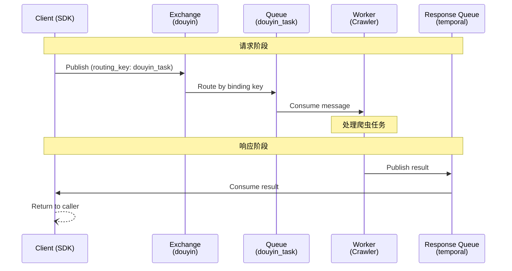

# 社交平台爬虫

基于 rabbimq 构建的社交平台爬虫，功能特点如下

1. 支持CLI或者容器运行。
   1. CLI主要用于开发环境测试，使用方式见下文。
   2. 对于生产环境，提供了客户端SDK和容器，SDK和容器将通过rabbimq异步传递任务，具体使用见下文。
2. 爬虫主体
   1. 统一异常处理
   2. 签名逆向
   3. 对抖音接口发起请求，接口详情见下文。
3. 自动发布SDK和容器


## 快速开始

本项目的爬虫有两种用法，一个是cli，一个是rabbitmq worker服务，前者主要用于开发测试，后者主要用于k8s部署。

## 开发环境使用CLI进行测试

先准备devcontainer的环境变量 `cp .devcontainer/.env.example .devcontainer/.env`，然后打开devcontainer，会自动启动rabbitmq.

安装依赖`pnpm install`

查看命令行所有可用方法：`pnpm dev:cli`

单个方法调用(具体参数含义见[cli.ts](./example/douyin/cli.ts)):

```bash
# 获取作品详情
pnpm dev:cli getAwemeDetail 7589820189332622611

# 获取用户作品列表
pnpm dev:cli getUserAwemeList MS4wLjABAAAANuGI7ssePACMvRn7Afd0daB9Su1k4oDr-kHUoUkNLSE 0 5

# 搜索视频
pnpm dev:cli searchAweme "风景" 0 5

# 获取用户关注列表
pnpm dev:cli getUserFollowing MS4wLjABAAAANuGI7ssePACMvRn7Afd0daB9Su1k4oDr-kHUoUkNLSE 0 5
```

执行所有测试用例（测试用例的定义在example/douyin/cli.ts中，默认并没有全部开启，每个测试随机5~10s间隔）:

```bash
pnpm dev:cli _all
```

### 可用方法列表

| 方法 | 参数 | 说明 | 是否需要签名 |
|------|------|------|-------------|
| `getAwemeDetail` | awemeId | 获取作品详情 | ✅ |
| `getUserAwemeList` | secUserId, maxCursor?, count? | 获取用户作品列表 | ❌ |
| `getUserFavoriteList` | secUserId, maxCursor?, count? | 获取用户喜欢列表 | ❌ |
| `getUserCollectionList` | secUserId, maxCursor?, count? | 获取用户收藏列表 | ❌ |
| `getMusicAwemeList` | musicId, maxCursor?, count? | 获取音乐作品列表 | ✅ |
| `getChallengeAwemeList` | challengeId, maxCursor?, count? | 获取话题作品列表 | ❌ |
| `getMixAwemeList` | mixId, maxCursor?, count? | 获取合集作品列表 | ❌ |
| `searchAweme` | keyword, cursor?, count?, searchType? | 搜索视频 | ❌ |
| `getUserFollowing` | secUserId, maxTime?, count? | 获取用户关注列表 | ❌ |
| `getUserFollowers` | secUserId, maxTime?, count? | 获取用户粉丝列表 | ✅ |
| `getAllUserAwemes` | secUserId, limit? | 获取用户所有作品 | ❌ |
| `getAllMusicAwemes` | musicId, limit? | 获取音乐所有作品 | ✅ |
| `getAllUserFollowers` | secUserId, limit? | 获取用户所有粉丝 | ✅ |

## 生产环境使用容器和sdk

获取镜像：`docker pull ghcr.m.daocloud.io/qiudeng7/crawler`

获取客户端SDK: `pnpm add @qiudeng/crawler-client`

部署爬虫和rabbimq (compose为例):
```yaml
services:
  rabbitmq:
    image: rabbitmq:3-management
    container_name: rabbitmq
    ports:
      - "5672:5672"
      - "15672:15672"
    environment:
      RABBITMQ_DEFAULT_USER: qiudeng
      RABBITMQ_DEFAULT_PASS: qiudeng
    healthcheck:
      test: ["CMD", "rabbitmq-diagnostics", "ping"]
      interval: 10s
      timeout: 5s
      retries: 5

  crawler:
    image: ghcr.m.daocloud.io/qiudeng7/crawler:latest
    container_name: crawler-worker
    depends_on:
      rabbitmq:
        condition: service_healthy
    environment:
      DOUYIN_COOKIE: "your_DOUYIN_COOKIE_here"
      RABBITMQ_HOST: rabbitmq
      RABBITMQ_PORT: "5672"
      RABBITMQ_USER: qiudeng
      RABBITMQ_PASS: qiudeng
      RABBITMQ_EXCHANGE: douyin
      RABBITMQ_QUEUE: douyin_task
      RABBITMQ_ROUTING_KEY: douyin_task
    restart: unless-stopped
```

通过SDK访问:
```ts
import { DouyinClient } from '@qiudeng/crawler-client';

// 创建客户端实例
const client = new DouyinClient({
  host: 'localhost', // RabbitMQ 地址
  port: 5672,
  user: 'qiudeng',
  pass: 'qiudeng',
  exchange: 'douyin',
});

// 使用示例
async function main() {
  // 获取作品详情
  const aweme = await client.getAwemeDetail('7589820189332622611');
  console.log('作品详情:', aweme);

  // 获取用户作品列表
  const userList = await client.getUserAwemeList('MS4wLjABAAAANuGI7ssePACMvRn7Afd0daB9Su1k4oDr-kHUoUkNLSE', 0);
  console.log('用户作品:', userList);

  // 搜索视频
  const searchResult = await client.searchAweme('风景', 0, 20);
  console.log('搜索结果:', searchResult);

  // 关闭连接
  await client.close();
}

main().catch(console.error);
```

### 工作方式

采用 RabbitMQ 消息队列架构，客户端 SDK 通过 RabbitMQ 与爬虫 Worker 通信。工作流程如下：


**消息流转过程**：
1. SDK 发送请求到 Exchange，指定 routing_key 为 `douyin_task`
2. Exchange 将消息路由到 `douyin_task` 队列
3. Worker 从队列中取出消息，调用相应的爬虫方法
4. Worker 将结果发送到 SDK 的临时响应队列
5. SDK 从响应队列获取结果并返回给调用方

## 环境变量

环境变量及注释见 [./.env.example](./.env.example)，开发环境配置`.env`会自动读取，生产环境为容器配置环境变量即可。

## 开发者文档

见 [开发者文档](./docs/开发者文档.md)

## Todo List

1. 重构request和sign
2. 代理
3. cookie和账号池·
